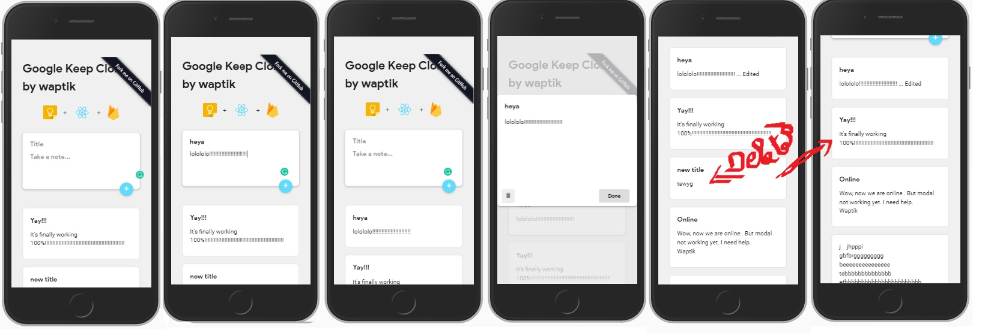

# Google Keep Clone with ReactJS and Firebase

This project was bootstrapped with [Create React App](https://github.com/facebook/create-react-app).

## Features

Features include:
* Adding of notes which are then saved to firebase database on the cloud
* Fetching and Listing notes from firebase
* Edit/Update any selected notes on the go
* Delete any selected notes

## Live demo
* A video demonstration is at [https://youtu.be/hD6xC7fRhOw](https://youtu.be/hD6xC7fRhOw)
You first need to have internet connection.
* For local demo, clone the repo on your machine by issuing these commands on your command prompt:
    * `git clone https://github.com/waptik/google-keep-reactjs-firebase.git`
    * `cd google-keep-reactjs-firebase`
    * `yarn start` or `npm start` and a new tab will automatically open in your browser. If not, just open [http://localhost:3000](http://localhost:3000) to view it in the browser.

* For online demo, Open [https://gkeep-react.netlify.com/](https://gkeep-react.netlify.com/) to view it in the browser.

## Issues, Feature Requests, and Contributing

Please make sure to read the full guidelines. Your issue may be closed without warning if you do not.

Issues

1. **Before reporting a new issue, browse through the [issues](https://github.com/waptik/google-keep-reactjs-firebase/issues) to see if your similar issue hasn't been in existance.**

Bugs

* Kindly write an indepth description of the bug alongside a demonstration(image/video) for better understanding.

Feature Requests

* Write a detailed issue, explaning what it should do or how.
* Include screenshot (if needed)

Contribution

* Fork the repo then clone the forked version locally.
* Do your modifications in the `dev` branch (if not existant, kindly create a new one).
* Ensure that your version is totally working at your end.
* Send a PR(Pull Request)

## FAQ

Coming Soon

## License

    Copyright 2019 Stephane Mensah

    Licensed under the Apache License, Version 2.0 (the "License");
    you may not use this file except in compliance with the License.
    You may obtain a copy of the License at

    http://www.apache.org/licenses/LICENSE-2.0

    Unless required by applicable law or agreed to in writing, software
    distributed under the License is distributed on an "AS IS" BASIS,
    WITHOUT WARRANTIES OR CONDITIONS OF ANY KIND, either express or implied.
    See the License for the specific language governing permissions and
    limitations under the License.

## Disclaimer
* Part of the css stylesheet was taken from [https://github.com/bchiang7/google-keep-vue-firebase](https://github.com/bchiang7/google-keep-vue-firebase)
* We do not have any affiliation with companies mentionned.